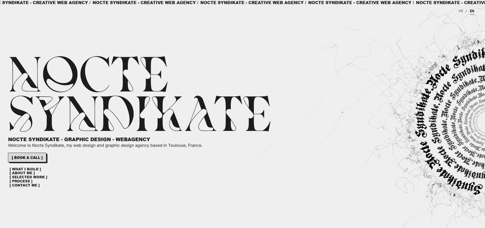

  

# Nocte Syndikate

**Nocte Syndikate** est mon agence web et studio de design graphique. Ce portfolio combine développement sur-mesure et identité visuelle marquante, plongeant l'utilisateur dans une esthétique à mi-chemin entre le brutalisme et le gothique moderne.

## 🚀 Fonctionnalités Principales

- **Support Multilingue (FR / EN) :** Intégration complète de `Transloco` avec un sélecteur de langue fluide, persistant et compatible SSR.
- **Scrollytelling & Animations :** Défilement fluide ("smooth scroll") avec `Lenis` et animations cinématiques avec `GSAP` pour une expérience immersive.
- **Composants 3D & Esthétique :** Modèles 3D en ASCII, effets de particules, curseur personnalisé et "glassmorphism".
- **Formulaire Serverless :** Formulaire de contact robuste, avec validation complète, relié à `Formspree`.
- **Performances & Modernité :** Architecture Angular moderne (Standalone Components), optimisation des rendus, et gestion stricte des dépendances.

## 🛠️ Stack Technique

## 📩 Contact

Pour toute demande, utilisez le formulaire de la section **Let's Talk** ou contactez-moi directement via mes réseaux.

---
*© 2026 Nocte Syndikate. Tous droits réservés.*
